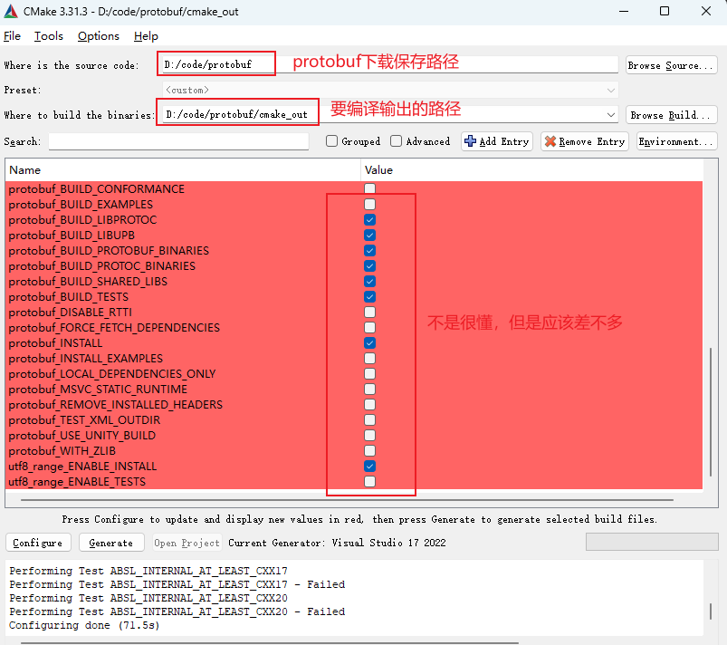
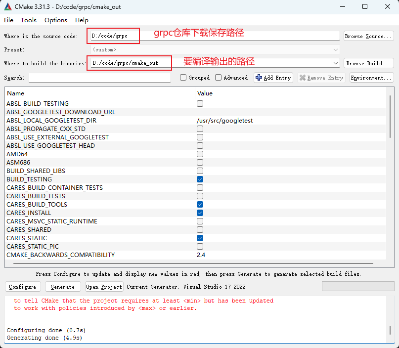

# connection

- tcp_and_udp: 很基础的tcp/udp传输
- grpc_connect: grpc通信(proto)（环境原因，可能有问题）

<!-- ## windows配置protobuf
[protobuf官方下载](https://github.com/protocolbuffers/protobuf/releases)，当然也可以直接 `git clone`

1. 克隆仓库：`git clone https://github.com/protocolbuffers/protobuf.git`
2. 更新子模块：`cd protobuf` && `git submodule update --init`
3. 编译：使用 cmake 编译，可以先创建个文件夹放编译好的内容，比如 `cmake_out`



4. 点击 Configure，再点击 Generate。
5. 生成之后用 visual studio 打开输出路径 `D:\code\protobuf\cmake_out` 内的 `protobuf.sln`，然后在解决方案资源管理器中右键，重新生成。（选择Debug x64 生成，可以顺便把 Release 也生成一下） -->

## windows配置c++的grpc

（有些问题没解决，但大概是这样吧）

[grpc官方仓库](https://github.com/grpc/grpc/tree/master)
[可参考视频](https://www.bilibili.com/video/BV1EP411e7p3)

（以下以我的windows路径`D:\code`作为示例介绍）

1. 克隆仓库：`git clone [-b <RELEASE_TAG_HERE>] https://github.com/grpc/grpc.git`
2. 更新子模块：`cd grpc` && `git submodule update --init`
3. 编译：使用 cmake 编译



4. 点击 Configure，再点击 Generate。

5. 生成之后用 visual studio 打开输出路径 `D:\code\grpc\cmake_out` 内的 `grpc.sln`，然后在解决方案资源管理器中的 `ALL_BUILD` 右键，重新生成。至此，grpc 就编译完成，可以使用了。（选择Debug x64 生成，可以顺便把 Release 也生成一下）
6. 创建项目：在 visual studio 创建一个控制台项目，然后将编写 proto 文件，并将其添加到资源文件中。
7. 编译proto文件：`D:\code\grpc\cmake_out\third_party\protobuf\Debug\protoc.exe -I=. --cpp_out=. --grpc_out=. --plugin=protoc-gen-grpc=D:\code\grpc\cmake_out\Debug\grpc_cpp_plugin.exe grpc_test.proto`，其中：
   1. `protoc.exe` 是在前面 cmake grpc 时候的输出路径的第三方库文件夹里的 protobuf 中（也可以将其配置到环境变量中）
   2. `--plugin=protoc-gen-grpc` 用的也是 cmake grpc 时输出路径中的文件，但是是直接在 Debug 文件夹中（也可以添加到环境变量）
   3. 反正看清楚上面的路径就懂了
   4. 以上命令会生成四个文件：`grpc_test.grpc.pb.cc`、`grpc_test.grpc.pb.h`、`grpc_test.pb.cc`、`grpc_test.grpc.pb.h`，后两个是消息的文件，前两个是 grpc 服务的文件。
   5. 在 visual studio 中的添加现有项，将以上四个文件添加进项目中，一起添加即可，会自动归类到源文件和头文件的。


8. 配置附加包含目录（平台一定要是x64）
   1. 属性——C/C++——常规——附加包含目录——编辑
   2. 在附加包含目录中添加 grpc 的第三方路径

```bash
D:\code\grpc\third_party\re2
D:\code\grpc\third_party\address_sorting\include
D:\code\grpc\third_party\abseil-cpp
D:\code\grpc\third_party\protobuf\src
D:\code\grpc\include
```
9. 配置附加库目录（平台一定要是x64）
   1. 属性——链接器——常规——附加库目录——编辑
   2. 在附加包含目录中添加 grpc 编译生成的 第三方的 Debug 路径

```bash
D:\code\grpc\cmake_out\third_party\re2\Debug
D:\code\grpc\cmake_out\third_party\abseil-cpp\absl\types\Debug
D:\code\grpc\cmake_out\third_party\abseil-cpp\absl\synchronization\Debug
D:\code\grpc\cmake_out\third_party\abseil-cpp\absl\status\Debug
D:\code\grpc\cmake_out\third_party\abseil-cpp\absl\random\Debug
D:\code\grpc\cmake_out\third_party\abseil-cpp\absl\flags\Debug
D:\code\grpc\cmake_out\third_party\abseil-cpp\absl\debugging\Debug
D:\code\grpc\cmake_out\third_party\abseil-cpp\absl\container\Debug
D:\code\grpc\cmake_out\third_party\abseil-cpp\absl\hash\Debug
D:\code\grpc\cmake_out\third_party\abseil-cpp\absl\numeric\Debug
D:\code\grpc\cmake_out\third_party\abseil-cpp\absl\time\Debug
D:\code\grpc\cmake_out\third_party\abseil-cpp\absl\base\Debug
D:\code\grpc\cmake_out\third_party\abseil-cpp\absl\strings\Debug
D:\code\grpc\cmake_out\third_party\abseil-cpp\absl\profiling\Debug
D:\code\grpc\cmake_out\third_party\boringssl-with-bazel\Debug
D:\code\grpc\cmake_out\third_party\protobuf\Debug
D:\code\grpc\cmake_out\third_party\zlib\Debug
D:\code\grpc\cmake_out\third_party\cares\cares\lib\Debug
D:\code\grpc\cmake_out\Debug
```

10. 配置附加依赖项（平台一定要是x64）
    1. 属性——链接器——输入——附加依赖项——编辑

```bash
libprotobufd.lib
gpr.lib
grpc.lib
grpc++.lib
grpc++_reflection.lib
address_sorting.lib
ws2_32.lib
cares.lib
zlibstaticd.lib
upb.lib
ssl.lib
crypto.lib
absl_bad_any_cast_impl.lib
absl_bad_optional_access.lib
absl_bad_variant_access.lib
absl_base.lib
absl_city.lib
absl_civil_time.lib
absl_cord.lib
absl_debugging_internal.lib
absl_demangle_internal.lib
absl_examine_stack.lib
absl_exponential_biased.lib
absl_failure_signal_handler.lib
absl_flags.lib
absl_flags_config.lib
absl_flags_internal.lib
absl_flags_marshalling.lib
absl_flags_parse.lib
absl_flags_program_name.lib
absl_flags_usage.lib
absl_flags_usage_internal.lib
absl_graphcycles_internal.lib
absl_hash.lib
absl_hashtablez_sampler.lib
absl_int128.lib
absl_leak_check.lib
absl_leak_check_disable.lib
absl_log_severity.lib
absl_malloc_internal.lib
absl_periodic_sampler.lib
absl_random_distributions.lib
absl_random_internal_distribution_test_util.lib
absl_random_internal_pool_urbg.lib
absl_random_internal_randen.lib
absl_random_internal_randen_hwaes.lib
absl_random_internal_randen_hwaes_impl.lib
absl_random_internal_randen_slow.lib
absl_random_internal_seed_material.lib
absl_random_seed_gen_exception.lib
absl_random_seed_sequences.lib
absl_raw_hash_set.lib
absl_raw_logging_internal.lib
absl_scoped_set_env.lib
absl_spinlock_wait.lib
absl_stacktrace.lib
absl_status.lib
absl_strings.lib
absl_strings_internal.lib
absl_str_format_internal.lib
absl_symbolize.lib
absl_synchronization.lib
absl_throw_delegate.lib
absl_time.lib
absl_time_zone.lib
absl_statusor.lib
re2.lib
```