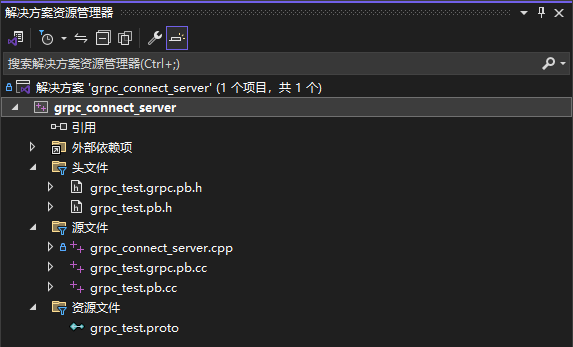

# connection

- [connection](#connection)
  - [包含](#包含)
  - [grpc文件语法](#grpc文件语法)
  - [windows配置c++的grpc](#windows配置c的grpc)
    - [下载相关软件](#下载相关软件)
    - [编译openssl](#编译openssl)
    - [cmake grpc](#cmake-grpc)
    - [Visual Studio build grpc](#visual-studio-build-grpc)
    - [使用grpc的项目配置](#使用grpc的项目配置)


## 包含
- tcp_and_udp: 很基础的tcp/udp传输
- grpc_connect: grpc通信(proto)


## grpc文件语法
假如proto文件内容如下：
```cpp
syntax = "proto3";
package grpc_test;

// 定义了一个名为 GetMimDisService 的服务
// 其中包含一个名为 GetMinDis 的 RPC 方法
// 该方法接受一个 GetMinDisReq 消息作为参数, 并返回一个 GetMinDisRsp 消息作为响应

message Vector {
    float x = 1;
    float y = 2;
    float z = 3;
}

// 输入消息类型
message GetMinDisReq {
    repeated Vector point_list = 1;
}

// 返回消息类型
message GetMinDisRsp {
    float min_dis = 1;
}

// 定义服务
service GetMimDisService {
    rpc GetMinDis (GetMinDisReq) returns (GetMinDisRsp) {}
}
```

proto文件中的message会生成对应的C++类，规则如下：
1. 数据结构的映射——字段名称：
   - proto字段名直接映射为类的方法名（以`set_`、`get_`、或`add_`开头）
   - 例如：
      - `Vector` 的字段 `x`，会生成：
         - `set_x(float value)`：设置 `x` 的值
         - `float x() const`：获取 `x` 的值。
      - `GetMinDisReq` 的字段 `point_list`，会生成：
         - `add_point_list()`：添加一个 `Vector` 对象到 `point_list。`
         - `repeated` 字段生成 `mutable_point_list()` 和 `point_list_size()`。`mutable_point_list()` 用于操作已有元素，`point_list_size()` 用于查询 `size`。
```cpp
// 添加一个新元素
// 通过以下代码，request 中就会有一个新的元素，并且元素值为{1.0f, 2.0f, 3.0f}
auto* vector = request.add_point_list();
vector->set_x(1.0f);
vector->set_y(2.0f);
vector->set_z(3.0f);

// 修改已有元素
// 通过以下代码，request 中的所有元素的x都会被设置成1.0f
auto* point_list = request.mutable_point_list();
for (auto& vector : *point_list) {
    vector.set_x(1.0f);
}
```
2. 数据结构的映射——嵌套字段：
   -  嵌套的 `message` 生成 `getter` 和 `setter` 方法。
   -  例如：`GetMinDisReq` 的 `point_list` 是 `repeated Vector`：
      -  `add_point_list()` 返回一个指向新建 `Vector` 的指针，需要对其字段进行赋值。
3. 服务的映射：`Proto` 文件中的 `service` 定义会生成一个存根类（`Stub`）和接口：
   - 服务名 `GetMimDisService`：
     - 生成一个静态方法 `NewStub`，创建服务的客户端存根。
     - 存根方法的名称与 `proto` 文件中的 `rpc` 名称一致。
     - 例如：`GetMinDis(GetMinDisReq) returns (GetMinDisRsp)` 会生成：
     - `Status GetMinDis(ClientContext* context, const GetMinDisReq& request, GetMinDisRsp* response);`


生成的文件主要包括两部分：
1. `grpc_test.pb.h` 和 `grpc_test.pb.cc`
   - 定义消息类（如 `Vector`，`GetMinDisReq`）。
   - 提供字段的 `getter/setter` 方法。
2. `grpc_test.grpc.pb.h` 和 `grpc_test.grpc.pb.cc`
   - 定义服务类（如 `GetMimDisService`）。
   - 提供存根类和方法。

`request` 用地址引用，`response` 用指针的原因（倒也不是，但是以下解释可以看看）：
- `request` 是输入参数，表示调用者提供的数据。通过引用传递表示你只需访问它的内容，而不需要创建副本。
- `response` 是输出参数，调用方法后它会被填充数据。通过指针传递可以清楚表达 "这个参数将被修改" 的含义。如果 `response` 是指针，可以显式检查其有效性（是否为空）。


## windows配置c++的grpc
[参考链接](https://blog.csdn.net/liyangbinbin/article/details/100134465)
[参考视频](https://www.bilibili.com/video/BV1EP411e7p3)

（以下以我的windows路径`D:\code`作为示例介绍）

### 下载相关软件
1. cmake：
   1. 官网下载：[https://cmake.org/](https://cmake.org/)
   2. 添加环境变量：`C:\Program Files\CMake\bin`
2. grpc：
   1. 从[grpc官方仓库](https://github.com/grpc/grpc/tree/master)克隆：`git clone [-b v1.34.0] https://github.com/grpc/grpc.git`，克隆到`D:\code`下
   2. **一定要到release页面选择版本并查看具体要求**，试了挺多版本用不了（我菜），这个版本比较老但是能用。
   3. 更新子模块：`cd grpc` && `git submodule update --init`
3. perl：
   1. 官网：[https://www.activestate.com/activeperl/downloads](https://www.activestate.com/activeperl/downloads)
   2. 在activestate，先选择好perl语言跟平台
   3. 然后在deploy选项下有安装流程
   4. 安装后在cmd查询`perl -v`有显示即表示安装完成
4. openssl：
   1. 官网下载：[https://www.openssl.org/source/](https://www.openssl.org/source/)
   2. 我这边下载完解压到了`D:\code`
5. nasm：
   1. 官网下载：[https://nasm.us/](https://nasm.us/)
   2. 添加环境变量：`C:\Program Files\NASM`
6. go：
   1. 官网下载：[https://golang.google.cn/](https://golang.google.cn/)
   2. 添加环境变量：`C:\Program Files\Go\bin`


### 编译openssl

1. **使用管理员权限**打开visual studio的命令行（很关键）
2. cd到`C:\Program Files (x86)\Microsoft Visual Studio 14.0\VC`，然后执行`vcvarsall.bat`
3. `Perl Configure VC-WIN64A no-shared no-asm --prefix=D:\code\openssl-3.4.0\build`
4. `nmake`
5. `nmake test`
6. `nmake install`
7. 添加环境变量，就是上面的文件夹`D:\code\openssl-3.4.0\build`

<div style="display: flex; flex-wrap: wrap; gap: 50px; justify-content: center;">
    
    
</div>

### cmake grpc
1. 在CMakeLists.txt中加入`set(CMAKE_CXX_STANDARD 17)`和`set(CMAKE_CXX_STANDARD_REQUIRED ON)`
2. 打开cmake，选择路径：
   1. 源文件路径选择：`D:/code/grpc`
   2. 输出文件路径选择：`D:/code/grpc/cmake_out`
3. 先运行一下Configure选择版本
4. 将`gRPC_SSL_PROVIDER`的`module`改成`package`（我是没用）
5. `gRPC_MSVC_STATIC_RUNTIME`，`CARES_MSVC_STATIC_RUNTIME`, `protobuf_MSVC_STATIC_RUNTIME`都勾选（我是没勾选，不然编译的时候会有静态跟动态的冲突，不知道怎么解决）
6. 1跟3跟4好像都不需要。直接按照默认就行
7. 再点击Configure和Generate

下图仅供参考


### Visual Studio build grpc
1. 之间在cmake点Open Project或者双击`D:\code\grpc\cmake_out\grpc.sln`
2. 在解决方案资源管理器中的 `ALL_BUILD` 右键，重新生成。至此，grpc 就编译完成，可以使用了。（选择Debug x64 生成，可以顺便把 Release 也生成一下）

我只编译了Debug版本，编译完是有问题的，但是好在需要用的cpp是没问题的，log如下：
<div style="display: flex; flex-wrap: wrap; gap: 50px; justify-content: center;">
    
    
</div>

### 使用grpc的项目配置
1. 创建项目：在 visual studio 创建一个控制台项目，然后将编写 proto 文件，并将其添加到资源文件中。
2. 编译proto文件：`D:\code\grpc\cmake_out\third_party\protobuf\Debug\protoc.exe -I=. --cpp_out=. --grpc_out=. --plugin=protoc-gen-grpc=D:\code\grpc\cmake_out\Debug\grpc_cpp_plugin.exe grpc_test.proto`，其中：
   1. `protoc.exe` 是在前面 cmake grpc 时候的输出路径的第三方库文件夹里的 protobuf 中（也可以将其配置到环境变量中）
   2. `--plugin=protoc-gen-grpc` 用的也是 cmake grpc 时输出路径中的文件，但是是直接在 Debug 文件夹中（也可以添加到环境变量）
   3. 反正看清楚上面的路径就懂了
   4. 以上命令会生成四个文件：`grpc_test.grpc.pb.cc`、`grpc_test.grpc.pb.h`、`grpc_test.pb.cc`、`grpc_test.grpc.pb.h`，后两个是消息的文件，前两个是 grpc 服务的文件。
   5. 在 visual studio 中的添加现有项，将以上四个文件添加进项目中，一起添加即可，会自动归类到源文件和头文件的。



3. 配置附加包含目录（平台一定要是x64）
   1. 属性——C/C++——常规——附加包含目录——编辑
   2. 在附加包含目录中添加 grpc 的第三方路径

```bash
D:\code\grpc\third_party\re2
D:\code\grpc\third_party\address_sorting\include
D:\code\grpc\third_party\abseil-cpp
D:\code\grpc\third_party\protobuf\src
D:\code\grpc\include
```
4. 配置附加库目录（平台一定要是x64）
   1. 属性——链接器——常规——附加库目录——编辑
   2. 在附加包含目录中添加 grpc 编译生成的 第三方的 Debug 路径

```bash
D:\code\grpc\cmake_out\third_party\re2\Debug
D:\code\grpc\cmake_out\third_party\abseil-cpp\absl\types\Debug
D:\code\grpc\cmake_out\third_party\abseil-cpp\absl\synchronization\Debug
D:\code\grpc\cmake_out\third_party\abseil-cpp\absl\status\Debug
D:\code\grpc\cmake_out\third_party\abseil-cpp\absl\random\Debug
D:\code\grpc\cmake_out\third_party\abseil-cpp\absl\flags\Debug
D:\code\grpc\cmake_out\third_party\abseil-cpp\absl\debugging\Debug
D:\code\grpc\cmake_out\third_party\abseil-cpp\absl\container\Debug
D:\code\grpc\cmake_out\third_party\abseil-cpp\absl\hash\Debug
D:\code\grpc\cmake_out\third_party\abseil-cpp\absl\numeric\Debug
D:\code\grpc\cmake_out\third_party\abseil-cpp\absl\time\Debug
D:\code\grpc\cmake_out\third_party\abseil-cpp\absl\base\Debug
D:\code\grpc\cmake_out\third_party\abseil-cpp\absl\strings\Debug
D:\code\grpc\cmake_out\third_party\abseil-cpp\absl\profiling\Debug
D:\code\grpc\cmake_out\third_party\boringssl-with-bazel\Debug
D:\code\grpc\cmake_out\third_party\protobuf\Debug
D:\code\grpc\cmake_out\third_party\zlib\Debug
D:\code\grpc\cmake_out\third_party\cares\cares\lib\Debug
D:\code\grpc\cmake_out\Debug
```

5. 配置附加依赖项（平台一定要是x64）
    1. 属性——链接器——输入——附加依赖项——编辑

```bash
libprotobufd.lib
gpr.lib
grpc.lib
grpc++.lib
grpc++_reflection.lib
address_sorting.lib
ws2_32.lib
cares.lib
zlibstaticd.lib
upb.lib
ssl.lib
crypto.lib
absl_bad_any_cast_impl.lib
absl_bad_optional_access.lib
absl_bad_variant_access.lib
absl_base.lib
absl_city.lib
absl_civil_time.lib
absl_cord.lib
absl_debugging_internal.lib
absl_demangle_internal.lib
absl_examine_stack.lib
absl_exponential_biased.lib
absl_failure_signal_handler.lib
absl_flags.lib
absl_flags_config.lib
absl_flags_internal.lib
absl_flags_marshalling.lib
absl_flags_parse.lib
absl_flags_program_name.lib
absl_flags_usage.lib
absl_flags_usage_internal.lib
absl_graphcycles_internal.lib
absl_hash.lib
absl_hashtablez_sampler.lib
absl_int128.lib
absl_leak_check.lib
absl_leak_check_disable.lib
absl_log_severity.lib
absl_malloc_internal.lib
absl_periodic_sampler.lib
absl_random_distributions.lib
absl_random_internal_distribution_test_util.lib
absl_random_internal_pool_urbg.lib
absl_random_internal_randen.lib
absl_random_internal_randen_hwaes.lib
absl_random_internal_randen_hwaes_impl.lib
absl_random_internal_randen_slow.lib
absl_random_internal_seed_material.lib
absl_random_seed_gen_exception.lib
absl_random_seed_sequences.lib
absl_raw_hash_set.lib
absl_raw_logging_internal.lib
absl_scoped_set_env.lib
absl_spinlock_wait.lib
absl_stacktrace.lib
absl_status.lib
absl_strings.lib
absl_strings_internal.lib
absl_str_format_internal.lib
absl_symbolize.lib
absl_synchronization.lib
absl_throw_delegate.lib
absl_time.lib
absl_time_zone.lib
absl_statusor.lib
re2.lib
```