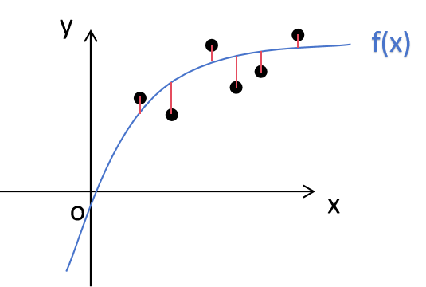
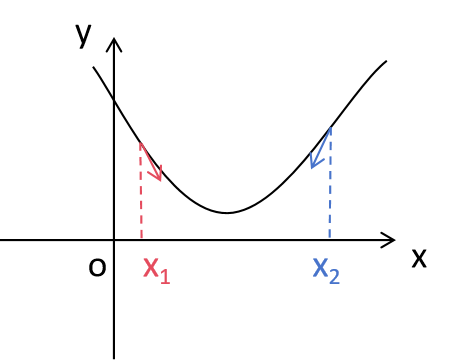
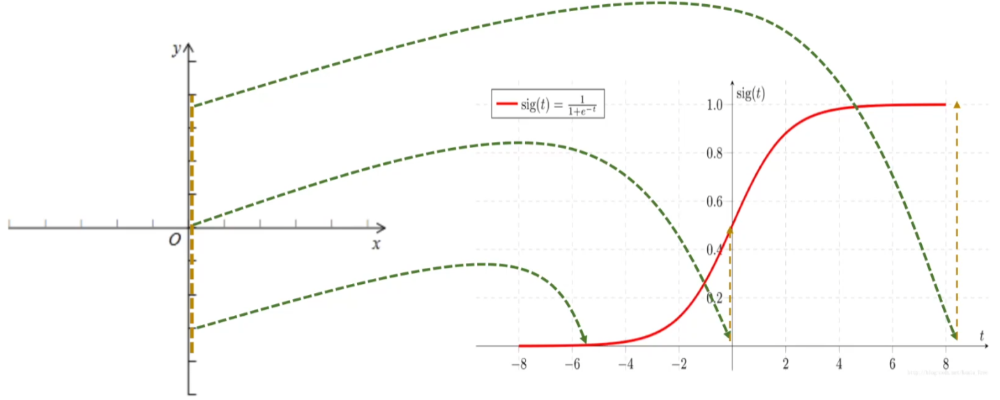

[参考链接](https://github.com/NairongZheng/notes/blob/main/%E6%9C%BA%E5%99%A8%E5%AD%A6%E4%B9%A02.md)
[TOC]
## 线性回归
回归分析：拟合一条曲线，让图中红色线段加起来的和最小。

线性回归是回归分析的一种：
1. 线性回归定义：
   1. “线性”限制的是parameter（参数），而不是feature（自变量）。
   2. 线性回归要做的是就是找到一个数学公式能相对较完美地把所有自变量组合（加减乘除）起来，得到的结果和目标接近。
   3. 所以线性的定是：自变量之间只存在线性关系，即**自变量只能通过相加、或者相减进行组合**（乘除k也可以）。
2. 线性回归过程：
   1. 假设目标值（因变量）与特征值（自变量）之间线性相关，即满足一个多元一次方程，如$f(x)=w_{1}x_{1}+...+w_{n}x_{n}+b$
   2. 然后构建损失函数
   3. 最后通过令损失函数最小来确定参数

以一元线性回归（一个未知自变量）为例：
有n组数据，自变量$x(x_{1},x_{2},...,x_{n})$，因变量$y(y_{1},y_{2},...,y_{n})$，二者之间关系为：$f(x)=ax+b$
那么线性回归的目标就是：**$a$和$b$取什么值的时候，$f(x)$和$y$最接近**

那么怎么度量二者的差异：**均方误差**是回归任务中最常用的性能度量
$$
J(a,b)=\sum_{i=i}^{n}(f(x_{i})-y_{i})^{2}=\sum_{i=i}^{n}(ax_{i}+b-y_{i})^{2}
$$
那么接下来的问题就剩下$a$和$b$取什么值时，$J(a,b)$最小

### 最小二乘法
分别对$a$和$b$求偏导，并令其为零：
$$
\frac{\partial{J(a,b)}}{\partial{a}}=2\sum_{i=1}^{n}x_{i}(ax_{i}+b-y_{i})\overset{\text{令}}{=}0
$$
$$
\frac{\partial{J(a,b)}}{\partial{b}}=\sum_{i=1}^{n}(ax_{i}+b-y_{i})\overset{\text{令}}{=}0
$$

### 梯度下降

梯度下降的更新公式为：
$$
a:=a-\alpha\frac{\partial{J(a,b)}}{\partial{a}}
$$
$$
b:=b-\alpha\frac{\partial{J(a,b)}}{\partial{b}}
$$
其中$\alpha$为学习率。
### 区别与联系
#### 区别
1. 最小二乘法可以直接通过矩阵运算或解析求解**得到最佳参数**，而梯度下降需要通过不断迭代来逐步**逼近最优解**。
2. 最小二乘法在处理**小规模问题**时效率高且精确；梯度下降则适用于**大规模数据集**，尤其是当数据量太大以至于无法一次性处理所有数据时（如在线学习或批处理）。
3. 最小二乘法的**时间复杂度通常较高**，尤其在处理多维线性回归（如有大量特征时），**因为需要计算逆矩阵**。而梯度下降的**时间复杂度较低**，尤其在处理大数据时，它可以通过**批量梯度下降**（mini-batch）进行更高效的优化。
#### 联系
1. 两者的目标都是通过最小化误差来找到最优的模型参数（如线性回归中的斜率和截距）。
2. **在最小二乘法中，误差平方和是直接最小化的对象，而在梯度下降中，误差平方和作为损失函数，通过计算它的梯度来进行迭代优化。**

## 逻辑回归
$\text{逻辑回归}=\text{线性回归}+sigmoid\text{函数}$
将取值范围$(−\infty,+\infty)$映射到$(0,1)$之间，更适宜表示预测的概率，即事件发生的“可能性”。再根据阈值进行分类。

线性回归：$z=w\times{x}+b$
sigmoid：$y=\frac{1}{1+e^{-z}}$
线性回归作为sigmoid的输入，所以逻辑回归公式如下：
$$
y=\frac{1}{1+e^{-w\times{x}+b}}
$$

逻辑回归损失函数：
$$
C=-[y\ln{a}+(1-y)\ln{(1-a)}]
$$
## 决策树
训练流程：
1. 根节点：在开始时，所有数据放在根节点。
2. 选择最优特征：根据信息增益、信息增益率或基尼指数选择最优的分类条件。
3. 数据集划分：根据该条件将数据集划分为不同的子集。
4. 递归：对每个子集递归地应用上述步骤，继续构建树。
5. 终止条件：当到达停止条件（如达到最大树深度或节点中的数据属于同一类），停止构建并生成叶节点。

### 节点特征选取
通过一种衡量标准，来计算通过不同特征进行分支选择后的分类情况，找出来最好的那个当成根节点，以此类推。
熵：
$$
H(X)=-\sum_{i=1}^{n}{p_{i}*\log{p_{i}}}
$$
信息增益：
$$
\text{信息增益}=\text{原始熵}-\text{划分后的熵}
$$

例子：
| id   | outlook  | temperature | humidity | windy | play |
| ---- | -------- | ----------- | -------- | ----- | ---- |
| 1    | sunny    | hot         | high     | false | no   |
| 2    | sunny    | hot         | high     | true  | no   |
| 3    | overcast | hot         | high     | false | yes  |
| 4    | rainy    | mild        | high     | false | yes  |
| 5    | rainy    | cool        | normal   | false | yes  |
| 6    | rainy    | cool        | normal   | true  | no   |
| 7    | overcast | cool        | normal   | true  | yes  |
| 8    | sunny    | mild        | high     | false | no   |
| 9    | sunny    | cool        | normal   | false | yes  |
| 10   | rainy    | mild        | normal   | false | yes  |
| 11   | sunny    | mild        | normal   | true  | yes  |
| 12   | overcast | mild        | high     | true  | yes  |
| 13   | overcast | hot         | normal   | false | yes  |
| 14   | rainy    | mild        | high     | true  | no   |

 

原始熵（9天打球，5天不打球）：
$$
\text{原始熵}=-\frac{9}{14}\times{\log_{2}{\frac{9}{14}}}-\frac{5}{14}\times{\log_{2}{\frac{5}{14}}}=0.940
$$
outlook-sunny-熵：$-\frac{2}{5}\times{\log_{2}{\frac{2}{5}}}-\frac{3}{5}\times{\log_{2}{\frac{3}{5}}}=0.971$
outlook-overcast-熵：$-\frac{4}{4}\times{\log_{2}{\frac{4}{4}}}=0$
outlook-rainy-熵：$-\frac{3}{5}\times{\log_{2}{\frac{3}{5}}}-\frac{2}{5}\times{\log_{2}{\frac{2}{5}}}=0.971$
最终outlook熵：
$$
\text{熵(outlook)}=\frac{5}{14}\times{0.971}+\frac{4}{14}\times{0}+\frac{5}{14}\times{0.971}=0.693
$$
信息增益：系统的熵值就由原始的0.940下降到了0.693，增益为：
$$
\text{gain(outlook)}=0.940-0.693=0.247
$$
同理可得到：
$$
\begin{cases}
\text{熵(temperature)}=\frac{4}{14}\times{1}+\frac{6}{14}\times{0.918}+\frac{4}{14}\times{0.881}=0.911\\
\text{gain(temperature)}=0.940-0.911=0.029\\
\end{cases}\\
\begin{cases}
\text{熵(humidity)}=\frac{7}{14}\times{0.985}+\frac{7}{14}\times{0.592}=0.788\\
\text{gain(humidity)}=0.940-0.788=0.152\\
\end{cases}\\
\begin{cases}
\text{熵(windy)}=\frac{8}{14}\times{0.811}+\frac{6}{14}\times{1}=0.892\\
\text{gain(windy)}=0.940-0.892=0.048\\
\end{cases}\\
$$
<!-- $$
\text{熵(temperature)}=\frac{4}{14}\times{1}+\frac{6}{14}\times{0.918}+\frac{4}{14}\times{0.881}=0.911\\
\text{gain(temperature)}=0.940-0.911=0.029\\
\text{熵(humidity)}=\frac{7}{14}\times{0.985}+\frac{7}{14}\times{0.592}=0.788\\
\text{gain(humidity)}=0.940-0.788=0.152\\
\text{熵(windy)}=\frac{8}{14}\times{0.811}+\frac{6}{14}\times{1}=0.892\\
\text{gain(windy)}=0.940-0.892=0.048\\
$$ -->
最终，outlook的信息增益最大，所以根节点为outlook，以此类推。

### 信息增益率和基尼系数
采用信息增益来划分节点会有些问题，如上例，若采用id来划分，那么信息增益为$0.940$，最大，但是这么划分没有意义。

信息增益率(**越大越好**)：
$$
\text{信息增益率}=\frac{\text{信息增益}}{\text{特征的熵}}
$$
上面例子的信息增益率分别如下：
$$
\begin{cases}
\text{信息增益率(id)}=\frac{0.940}{(-\frac{1}{14}\log_{2}{\frac{1}{14}})\times{14}}=0.247\\
\text{信息增益率(outlook)}=\frac{0.247}{0.693}=0.356\\
\text{信息增益率(temperature)}=\frac{0.029}{0.911}=0.032\\
\text{信息增益率(humidity)}=\frac{0.152}{0.788}=0.193\\
\text{信息增益率(windy)}=\frac{0.048}{0.892}=0.054\\
\end{cases}\\
$$

基尼系数：是一种衡量数据集中不纯度的指标，**值越低表示数据集越纯**。
$$
\text{gini}=1-\sum_{i=1}^{n}p_{i}^{2}
$$
上面例子的基尼系数分别如下：
$$
\begin{cases}
\text{基尼系数(id)}=1-{\frac{1}{14}}^{2}\times{14}=0.929\\
\text{基尼系数(outlook)}=1-({\frac{5}{14}}^{2}+{\frac{4}{14}}^{2}+{\frac{5}{14}}^{2})=0.663\\
\text{基尼系数(temperature)}=1-({\frac{4}{14}}^{2}+{\frac{6}{14}}^{2}+{\frac{4}{14}}^{2})=0.653\\
\text{基尼系数(humidity)}=1-({\frac{7}{14}}^{2}+{\frac{7}{14}}^{2})=0.5\\
\text{基尼系数(windy)}=1-({\frac{8}{14}}^{2}+{\frac{6}{14}}^{2})=0.49\\
\end{cases}\\
$$
### 剪枝
剪枝（Pruning） 的主要目的是为了简化模型，减少过拟合，从而提高模型在新数据上的泛化能力。
剪枝通过去掉不必要的节点或分支，减少模型复杂度，进而提高决策树的预测准确性。
1. 预剪枝：决策树构建的过程中，通过设定某些停止条件，提前终止树的生长，防止其过度生长。
   1. **最大深度限制**：设定决策树的最大深度，当树达到最大深度时，停止继续分裂节点。这样可以防止决策树过度复杂。
   2. **最小样本数限制**：设定每个节点需要包含的最小样本数，若某个节点中的样本数少于该值，则不再对该节点进行分裂。这可以避免过度细分那些数据量不足的节点。
   3. **信息增益阈值**：设定一个信息增益的阈值，只有当分裂能带来足够大的信息增益时才允许分裂，避免因为过小的信息增益导致的过拟合。
   4. **叶节点纯度**：如果某个节点已经几乎完全纯（例如，90%以上的样本属于同一类），可以停止分裂，直接将该节点作为叶节点。
2. 后剪枝
   1. 最小误差剪枝：通过交叉验证来评估每个子树的误差，判断是否应该剪枝。具体方法是比较剪枝后的误差与不剪枝的误差，如果剪枝后的误差更小或相同，就将该节点剪去，变为叶节点。

| 剪枝方式 | 优点                             | 缺点                     |
| -------- | -------------------------------- | ------------------------ |
| 预剪枝   | 快速，减少训练时间，防止过度生长 | 容易导致欠拟合，剪枝过早 |
| 后剪枝   | 能捕捉更复杂的模式，剪枝效果更好 | 计算量大，训练时间较长   |
## 集成学习
1. Bagging：通过对数据集进行多次**有放回**的随机抽样，训练多个基模型，然后对这些模型的预测结果进行**平均（回归问题）或投票（分类问题）**，以得到最终的预测结果。随机森林是Bagging的一个典型应用。
2. Boosting：是一种通过迭代地构建多个弱学习器（如浅层决策树），并逐步纠正前一个模型的错误的集成学习方法。每一轮训练中，Boosting会根据前一轮模型的错误情况来调整样本的权重，使得模型在迭代过程中越来越关注难以预测的样本。

| 方法     | 优点                                                         | 缺点                                                         | 例子     |
| -------- | ------------------------------------------------------------ | ------------------------------------------------------------ | -------- |
| Bagging  | 1. **减少过拟合**：对原始数据集的随机抽样，减少模型方差，防止过拟合。 2. **提高稳定性**：尤其适用于高方差模型（如决策树），通过多个模型的平均，可以降低单个模型对噪声数据的敏感性。 3. **并行化**：多个模型可以并行训练，速度较快。 | 1. **偏差未必减少**：Bagging虽然能降低方差，但无法减少偏差。如果基模型本身的性能不够好，集成的效果可能有限。 2. **计算资源需求较高**：要训练多个模型，消耗的内存和计算资源会增大。 | 随机森林 |
| Boosting | 1. **提升精度**：Boosting 通过逐步纠正模型的错误，能有效减少模型的偏差，提升模型的准确率。 2. **更强的模型**：Boosting 通常比 Bagging 更强大，因为它着重修正前一轮的错误。 | 1. **容易过拟合**：由于 Boosting 方法持续加强难预测的样本，它在训练集上的表现非常好，但可能会过拟合。 2. **训练时间较长**：由于模型是依次训练的，不能并行，训练时间较长。 3. **对噪声敏感**：如果数据中有噪声或异常值，Boosting 可能会过度关注这些数据点，影响模型的性能。 | GBDT     |

### 随机森林
#### 流程
1. 数据采样：通过有**放回的方式**从原始训练数据集中抽取若干个样本集（每个样本集的大小与原始数据集相同，但样本会重复）。
2. 决策树训练：对每个样本集，构建一棵决策树。在树的每个节点分裂时，**随机选择部分特征进行最优分裂**。
3. 模型集成：将多棵独立决策树的预测结果进行综合：
   1. 分类问题：采用多数投票的方式决定最终分类结果。
   2. 回归问题：采用平均方式得到最终的回归值。
#### 核心思想
1. **样本随机性**：每棵树都是通过对训练数据集进行有放回的随机抽样（Bootstrap）得到的不同子数据集进行训练的。每个子数据集的大小与原数据集相同，但因为有放回，部分样本可能会被重复采样，部分样本不会被选中。$p(\text{从未被选中})=(1-\frac{1}{N})^{N}\overset{N\rightarrow{\infty}}{\approx}e^{-1}\approx{36.79\%}$
2. **特征随机性**：在构建每棵决策树时，随机选择一部分特征来进行分裂，而不是使用全部特征。这种特征随机性有助于降低各决策树之间的相关性，进一步减少过拟合的可能性。
### GBDT
